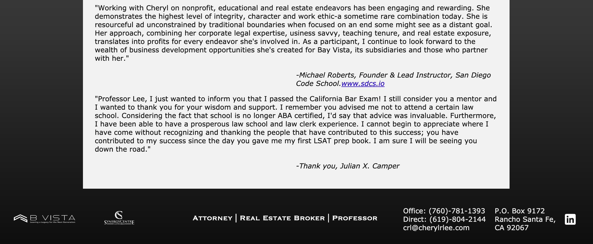
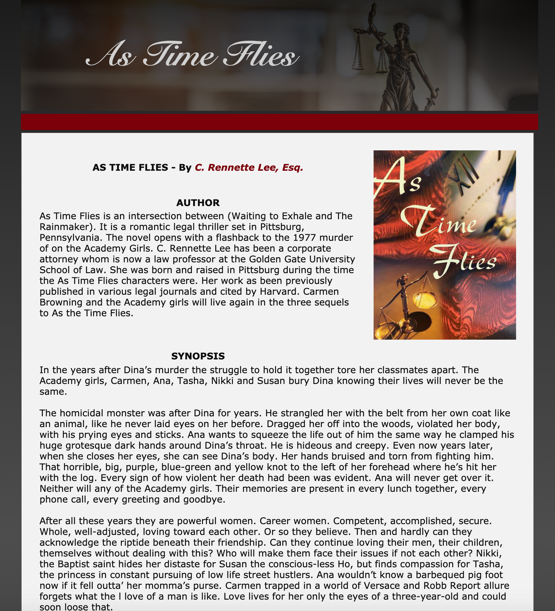
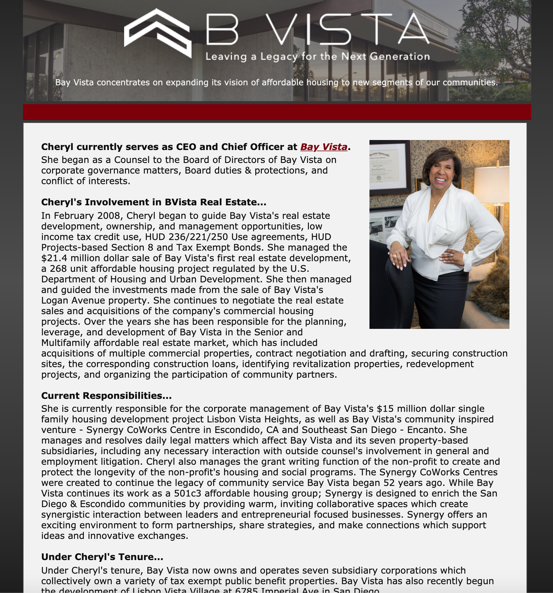
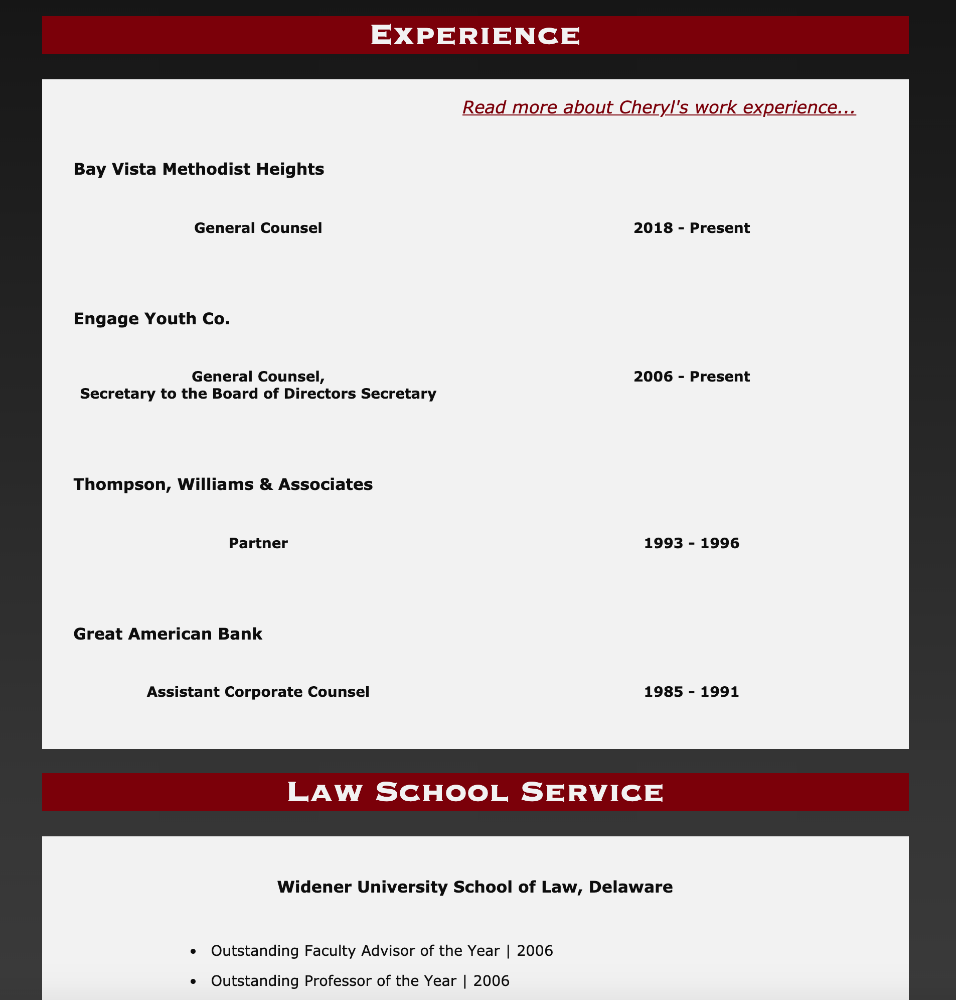
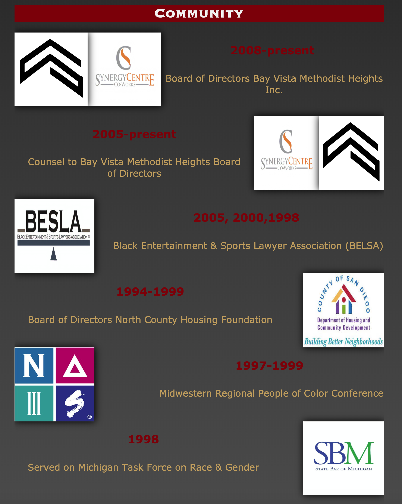
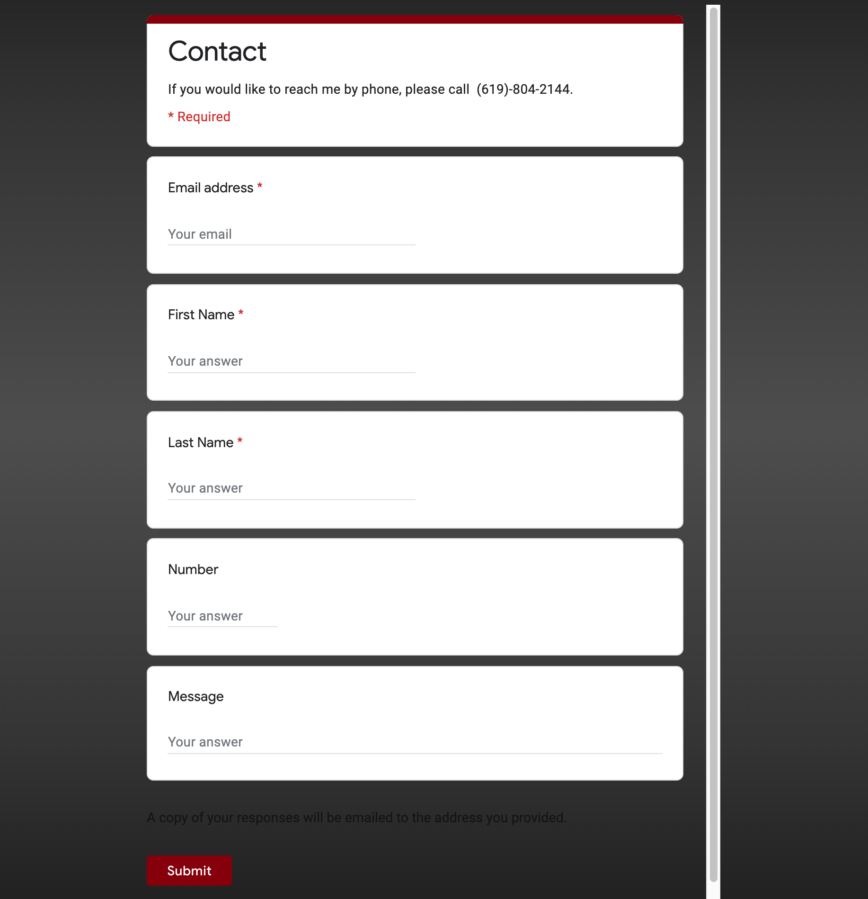

# Cheryl-Lee-Website-Review

This was a private SDCS project for my mid-term as a simulation contract for a real life client, Mrs. Lee. Built with React, Parcel, and Sass. Showcases Ms. Lee's achievements, affiliations, and credentials with a clean and classy appearance, including an automated contact page. Leveraging my soft skills and proficiencies in HTML and CSS w/SASS, I played a crucial leading role in this project, designing a responsive cross-platform website with well-kept code. I was responsible for designing the main title, navigation bar, home page, and the footer specifically. Being passionate about this project, I followed up with Ms. Lee to update and finalize the project, video demonstration coming soon.  

* **Thank you**, ***-Miles Mickelson***
